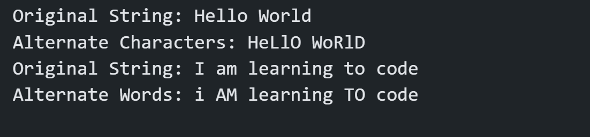

# Alternate-character
This is a python program that reads in a string and makes each alternate character into an upper case character and each other alternate character a lower case character. e.g. The string “Hello World” would become “HeLlO WoRlD”. Also, the string: “I am learning to code” would become “i AM learning TO code”.

## Table of Contents
- [Alternate-character](#alternate-character)
  - [Table of Contents](#table-of-contents)
  - [Installation](#installation)
  - [Usage](#usage)
  - [License](#license)
  - [Contributing](#contributing)
  - [Credits](#credits)
  - [Tests](#tests)
  - [Questions](#questions)

## Installation
How to install Python in terminal?
Step 1: Download the Python installer. Visit the official Python website and download the latest version of Python 3.x for Windows. ...
Step 2: Run the Installer. ...
Step 3: Customize the Installation (Optional) ...
Step 4: Install Python. ...
Step 5: Verify the installation.

How to add pip to path Python?
How to Add Python Pip to Path
Locate pip Installation:
Modify the PATH Environment Variable for this session:
Modify the PATH Environment Variable permanently:
Verify the Modification:
Locate pip Installation:
Modify the PATH Environment Variable:
Add the Path to the Environment Variables:
Verify the Modification:

## Usage

A screenshot of the outcomes is shown here:

The repository can be accessed using this link:https://github.com/Mikemupararano/alternate-character.

## License
This application is covered under the MIT license.

## Contributing
 N/A

## Credits
N/A
## Tests
N/A

## Questions
For any questions or concerns, please contact me at [kudath@yahoo.co.uk](mailto:kudath@yahoo.co.uk).
You can also find me on GitHub: [https://github.com/Mikemupararano](https://github.com/https://github.com/Mikemupararano)
